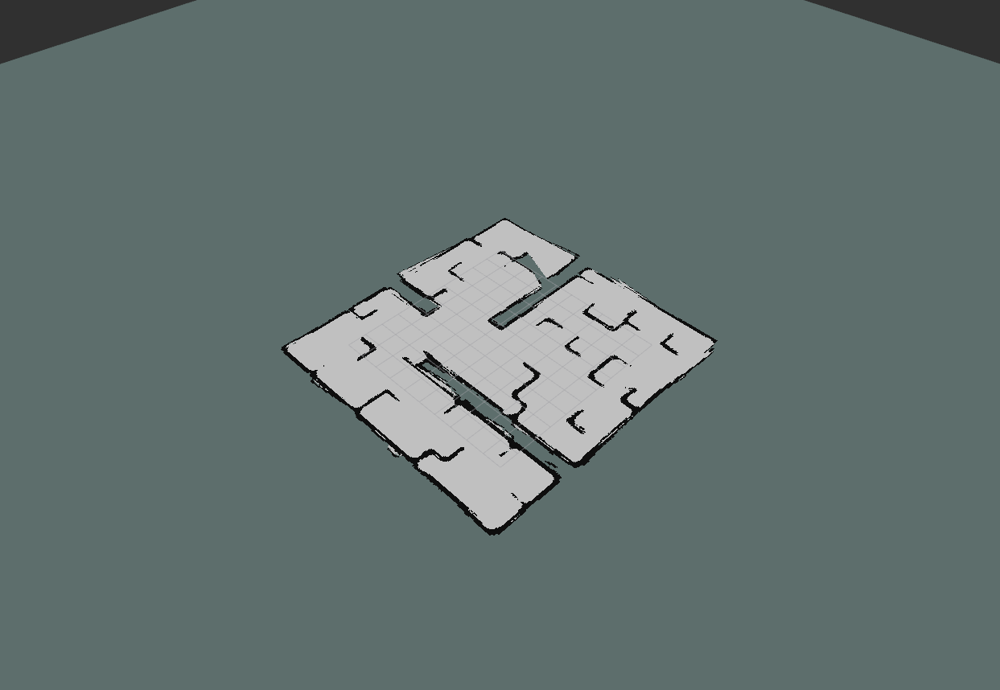

# Fast-GPOM

This is our project folder for **Fast Gaussian Processes Occupancy Maps** that has been accepted by ICARCV2018. It is on top of [the implementation of Maani Ghaffari Jadidi](https://github.com/MaaniGhaffari/gp_occ_mapping).

## Step 1:  Setup Environment

`Implement the exist ROS package for next works.`

`Link: <https://github.com/MaaniGhaffari/gp_occ_mapping>`

### Software Configuration
- Ubuntu 16.04
- ROS Kinetic
- Python 2/3

### Setup Python Environment

- python2
    Here recommend to use python2. Using system python2 or creating a python2 conda environment, for example(conda):
    ```
    conda create -n gpom python=2.7
    source activate gpom
    ```
    if you can't perform `catkin_make` with python, you could using below instruction to install ROS python environment:
    ```
    pip install catkin-tools
    pip install rospkg
    ```
    also, you need to install some dependencies like: numpy, scipy and so on.
    you could use `conda` or `pip` to install these dependencies.
- python3
    If you want to use python3 with ROS. It is possible. First, you need create a conda environment:
    ```
    conda create -n gpom python=3
    source activate gpom
    ```
    The dependencies like previous.

- Warning:
    If you get below error while execute `catkin_make`:
    ```
    No module named em
    ```
    you could execute below command to solve it:
    ```
    pip uninstall em
    pip install empy
    ```
-  dependencies
    -  numpy
    -  scipy
    -  matplotlib
    -  scikit-image
    -  pyGPs: <https://github.com/marionmari/pyGPs>

    ```
    source activate gpom
    conda install numpy scipy matplotlib scikit-image
    pip install pyGPs
    ```

### Download code
- building ROS workspace:
    ```
    mkdir -p your_catkin_workspace/src
    cd your_catkin_workspace/src
    catkin_init_workspace
    cd ..
    source activate gpom
    catkin_make
    ```
    If you use python3 with ROS, you have to make sure your workspace contain geometry and geometry2 packages to solve tf problem.

    The workflow like below:
    ```
    cd your_catkin_workspace/src
    git clone https://github.com/ros/geometry.git
    git clone https://github.com/ros/geometry2.git
    cd ..
    catkin_make
    ```
- download code
    ```
    cd your_catkin_workspace/src
    git clone https://github.com/Jarrome/fun-gpom.git
    cd ..
    source activate gpom
    catkin_make
    source devel/setup.bash
    ```

## Step 2: GPOM with STDR simulation dataset
### STDR simulation environment
We use STDR simulator as our experiment environment. It is very powerful tool to do mapping experiment, and it also provide ground truth for map.

- Usage
    The tutorial of STDR simulator is showed their website or ROS wiki:
    website link: <https://stdr-simulator-ros-pkg.github.io/>
    ROS wiki: <http://wiki.ros.org/stdr_simulator>

- Use my modified version(more suit to gpom packages)
    - Launch Simulator
        ```
        cd your_catkin_workspace/src
        git clone https://github.com/KuangHaofei/stdr_simulator.git
        cd ..
        catkin_make
        source devel/setup.bash
        roslaunch stdr_launchers server_with_map_and_gui_plus_robot.launch
        ```
    - Control Robot move by using keyboard
        ```
        rosrun teleop_twist_keyboard teleop_twist_keyboard.py cmd_vel:=robot0/cmd_vel
        ```
        - warning: make sure you use it at python2 environment.

### gpom with STDR simulator
- Dataset
    We have make a dataset by using STDR simulator, some details of it are showed below:
    - Duration: 306 s
    - Published Topics:
        - tf ([tf/tfMessage](http://docs.ros.org/api/sensor_msgs/html/msg/LaserScan.html))
        - robot0/laser_0 ([sensor_msgs/LaserScan](http://docs.ros.org/api/sensor_msgs/html/msg/LaserScan.html))
        - slam_out_pose ([geometry_msgs/PoseStamped](http://docs.ros.org/api/geometry_msgs/html/msg/PoseStamped.html)

- Usage
    Here, we also use python3, and you need to change the path of the bag file in fast_gpom_offline.py file firstly:    
    (It is a replay of bags, you can run directly)
#### fast gpom with STDR simulated bag(real-time)
- Usage
    Here, assume we use python3: 
    ```
    cd your_catkin_workspace
    source activate gpom
    catkin_make
    source devel/setup.bash
    roslaunch gp_occ_mapping fast_gpom_online.launch
    ```
    Just wait seconds and it will works.
    
    
    
#### fast gpom with STDR simulated bag(off-line)
- Usage
    ```
    cd your_catkin_workspace
    source activate gpom
    catkin_make
    source devel/setup.bash
    roslaunch gp_occ_mapping fast_gpom_offine.launch
    ```
You could see a fastgpom being generated without display. But it will save a .mat in the end.

#### Others
Some other launch file like  gpom_offline.launch gpom_online.launch is also available. You can use similar command to run it.
